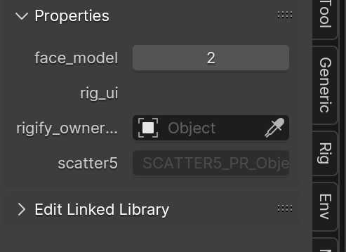

import imgSelectedActive from './ingame-rigs/selected-active.png';

import Figure from '@/components/md/Figure.astro';

> Everything is heavily WIP

# Small crash-course

- Blender has two "different" selections; <mark>selected objects</mark> (one or more) and <mark>active object</mark> (only ever one)
- Distinguishable from selection color; default color orange for selection, bright orange/yellow for active object
- This is important for some operations
  - Parenting will always parent things to the active object
  - This is why guides will sometimes read "select `x` first and then select `y`"

<Figure
  src={imgSelectedActive}
  alt="Selected object (left) and active object (right)"
/>

# Importing things

- You want to import things in `.fbx` format instead of `.dae` (reasons? preserves armatures better)
- Usually imported scale is off
  - Splatoon 2 gear should be scaled to approx `0.13`
  - Splatoon 3 gear should be scaled to `1.0`
  - Important: scale up the armature, not the meshes

# Adding things on character

## Hair

1. Import hair model
1. Select only armature
1. Scale armature to correct size
1. Move hair to place (hint: X and Y at 0, Z to `1.2523m`)
1. Select hair armature first, then holding `Shift` select the character rig second
1. Enter pose mode
1. Select the head bone (it's a yellow-colored ring at the top of the head)
1. Press `Ctrl-P` and in _Set Parent To_ choose _Bone_

- this parents the selected object (hair armature) to the head bone (on the character rig)

## Clothes

# How to

## How to smiling/frowning face

  

In 3D view:

1. If you are not in <mark>Object mode</mark>, switch to <mark>Object mode</mark>

1. Select the rig/armature

1. Open the "N-panel"/right side panel if it's not already open (`n` on the keyboard)

1. Go to the <mark>Item</mark> tab

1. Under <mark>Properties</mark> there is a property named `face_model`; set it to `1` for the default neutral face, `2` for smiling, `3` for frowning

<clear />

  
Tech info

The three different face models are their own separate objects, found in the rig's `face` collection. Changing faces has been implemented through Blender's <mark>Drivers</mark>,
which shows/hides the appropriate face models.

